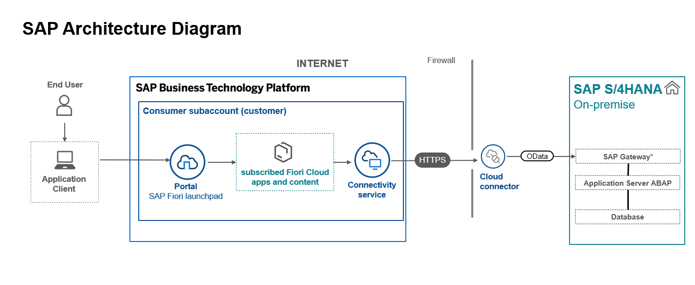
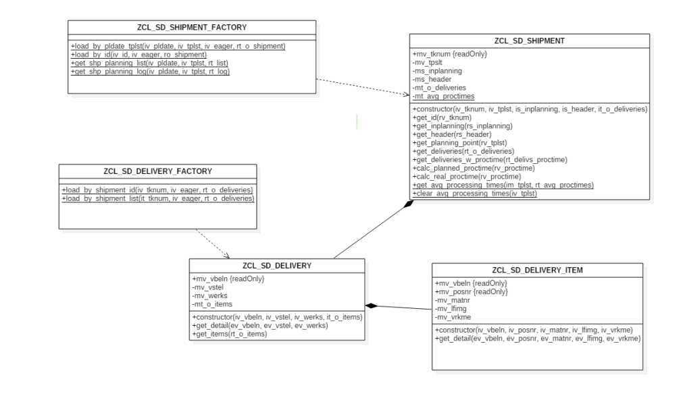

## Application Details

|                                                                                                    |
| -------------------------------------------------------------------------------------------------- |
| **Generation Date and Time**<br>Fri Nov 17 2023 16:49:01 GMT+0100 (Central European Standard Time) |
| **App Generator**<br>@sap/generator-fiori-freestyle                                                |
| **App Generator Version**<br>1.9.6                                                                 |
| **Generation Platform**<br>Visual Studio Code                                                      |
| **Template Used**<br>simple                                                                        |
| **Service Type**<br>SAP System (ABAP On Premise)                                                   |

|**Service URL**<br>https://a03z.ucc.ovgu.de//sap/opu/odata/sap/ZSD_GW_SHIPMENT_03_SRV
|**Module Name**<br>shipmentmanagement|
|**Application Title**<br>Shipment Management|
|**Namespace**<br>ap|
|**UI5 Theme**<br>sap_horizon|
|**UI5 Version**<br>1.120.1|
|**Enable Code Assist Libraries**<br>False|
|**Enable TypeScript**<br>False|
|**Add Eslint configuration**<br>False|

## shipmentmanagement

A Fiori application.

### Starting the generated app

- This app has been generated using the SAP Fiori tools - App Generator, as part of the SAP Fiori tools suite. In order to launch the generated app, simply run the following from the generated app root folder:

```
    npm start
```

- It is also possible to run the application using mock data that reflects the OData Service URL supplied during application generation. In order to run the application with Mock Data, run the following from the generated app root folder:

```
    npm run start-mock
```

#### Pre-requisites:

1. Active NodeJS LTS (Long Term Support) version and associated supported NPM version. (See https://nodejs.org)

# Verdere Documentatie:

U kunt het volledige project vinden op de volgende locatie: [ShipmentManagement GitHub Repository](https://github.com/SalouaElM/ShipmentManagement)

Om het project in Visual Studio Code te kunnen bewerken, heeft u de volgende plugin nodig: SAP Fiori Tools - Extension Pack

### Architecture Diagram:



## ZSD_03_SHIPMENT_MANAGEMENT Gateway-service

### Service URI:

`/sap/opu/odata/sap/ZSD_GW_SHIPMENT_03_SRV/`

## Entiteiten

### ShipmentSet

#### Attributen:

- TKNUM (Shipment number)
- TPLST (Planning Point)
- VBTYP (Shipment Type)
- SHTYP (Shipment Category)
- ERDAT (Document Date)
- ABFER (Earliest Loading Date)
- SIGNI (Container ID)
- UAREG (Loading Point)
- STLBG (Start Loading Status)
- STABF (Shipment Completion Status)
- UPABF (Loading Status Updated By)
- UZABF (Shipment Completion Status Updated By)
- DPTBG (Loading Point Departure Date)
- UATEN (Loading Point Arrival Time)
- STTRG (Transportation Planning Point)
- TDLNR (Transporter)
- STREG (Return Loading Point)
- UPREG (Return Loading Status Updated By)
- PLANNED_DATE (Planned Date)
- TIME_IN (Time In)
- TIME_OUT (Time Out)
- APP_TIME (Planned Arrival Time)
- REMARKS (Remarks)
- O_DELIVERIES (Associated Deliveries)
- AVG_PROCTIMES (Average Processing Times)

### DeliverySet

#### Attributen:

- TKNUM (Shipment number)
- VBELN (Delivery number)
- VSTEL (Shipping Point)
- WERKS (Plant)
- ITEMS (Associated Items)

### DeliveryItemSet

#### Attributen:

- VBELN (Delivery number)
- POSNR (Item number)
- MATNR (Material number)
- VRKME (Sales Unit)
- LFIMG (Quantity)
  _Opmerking: Vanwege de relatie met VBELN, bevat DeliveryItemSet slechts één item._

## Association

### ShipmentToDeliveryAssociation

#### Beschrijving:

Verbinding tussen ShipmentSet en DeliverySet.

#### Verbinding:

TKNUM in ShipmentSet komt overeen met TKNUM in DeliverySet.

### DeliveryToItemAssociation

#### Beschrijving:

Verbinding tussen DeliverySet en DeliveryItemSet.

#### Verbinding:

VBELN in DeliverySet komt overeen met VBELN in DeliveryItemSet.

## Methoden gebruik in de gataway

- DELIVERYITEMSET_GET_ENTITYSET: Haalt een set van DeliveryItem-entiteiten op.
- DELIVERYSET_GET_ENTITY: Haalt een enkele Delivery-entiteit op.
- DELIVERYSET_GET_ENTITYSET: Haalt een set van Delivery-entiteiten op.
- SHIPMENTLOGSET_GET_ENTITYSET: Haalt een set van Shipment Log-entiteiten op.
- SHIPMENTSET_GET_ENTITY: Haalt een enkele Shipment-entiteit op.
- SHIPMENTSET_GET_ENTITYSET: Haalt een set van Shipment-entiteiten op.

## Het klasse diagram


